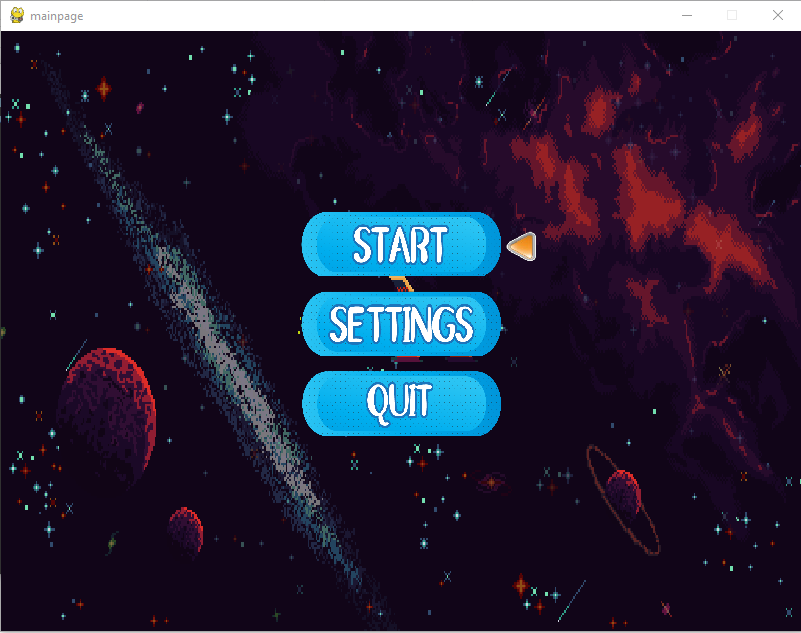
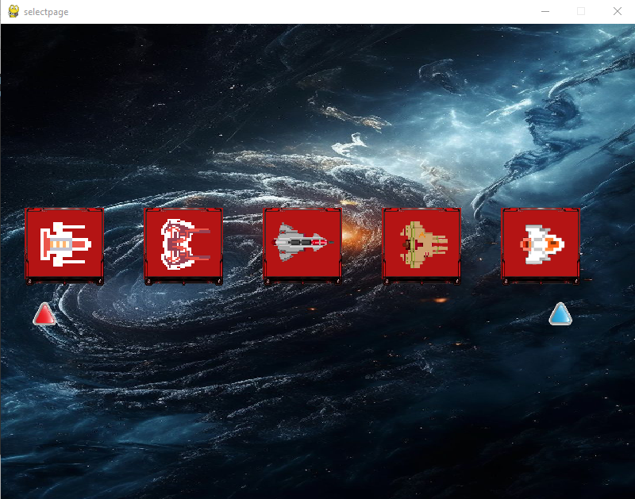
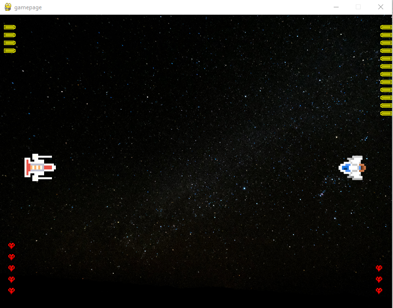

# AirWre Game

This is a simple 2D airplane game developed by two beginners using Pygame. The game features multiple airplane types with unique abilities, several maps, and an online mode using sockets. 

## Control Buttons

### Player 1 Controls:
- **Up**: Arrow Up or **Z**
- **Down**: Arrow Down or **S**
- **Right**: Arrow Right or **D**
- **Left**: Arrow Left or **Q**
- **Shoot**: **Space**
- **Hide**: **9** (To hide behind barriers)

### Player 2 Controls:
- **Up**: Arrow Up or **Z**
- **Down**: Arrow Down or **S**
- **Right**: Arrow Right or **D**
- **Left**: Arrow Left or **Q**
- **Shoot**: **G**
- **Hide**: **H** (To hide behind barriers)

### Additional Controls:
- **Revive Player**: **SPACE**

## AirWre Types

1. **Plane 0**: Shoots two projectiles at once.
2. **Plane 1**: Each time it hits the enemy, it takes away their health.
3. **Plane 2**: Enables the ability to hide behind barriers. Be careful, as staying there too long will lead to death. Activated by pressing **H** (Player 2) or **9** (Player 1).
4. **Plane 3**: Shoots three types of projectiles, each with progressively higher damage.
5. **Plane 4**: Has a large ammo capacity. Once the ammo is exhausted, wait for it to reload, and your health will also regenerate.

## Game Maps
The game comes with **10 unique maps**.

## Project Details
- **Date of Creation**: 2023/12/10
- **Last Update**: 2025/01/04
- **Languages Used**: Python (Pygame)
- **Developers**: Two beginners in game development

## Online Mode

The game now supports **online mode** through sockets. The setup for online play is as follows:

1. **Config File**: You can configure the IP address and port for connecting the two devices in the `config.py` file.
2. **Server Mode**: To activate the network mode, set the `server_controller` variable to `True` in the main game code. Ensure that the IP address is correctly set on both devices.
3. **Client Mode**: On the second device, use the `client.py` file to connect to the server and play together. Be sure to set the correct IP in the client configuration.
4. **Running the Game**:
   - First, run the main game code on the **server device**.
   - Then, run the **client.py** file on the **client device**.

> Note: Both devices must have access to the network and use the same port for communication.

## How to Play

- Player 1 uses **Z**, **S**, **D**, **Q** to control their airplane and **Space** to shoot.
- Player 2 uses **Up**, **Down**, **Right**, **Left** to control their airplane and **G** to shoot.
- Press **R** to revive a player when they lose their life.
- Players can hide behind barriers using the **9** (Player 1) or **H** (Player 2) keys. But be cautious! Staying behind for too long may result in death.

## File Structure

- `main.py`: Main game code with game logic and control flow.
- `config.py`: Configuration file to set up the IP and port for network play.
- `client.py`: Client-side code for connecting to the server and playing the game.

## Game Screenshots

  
  

Enjoy the game!
